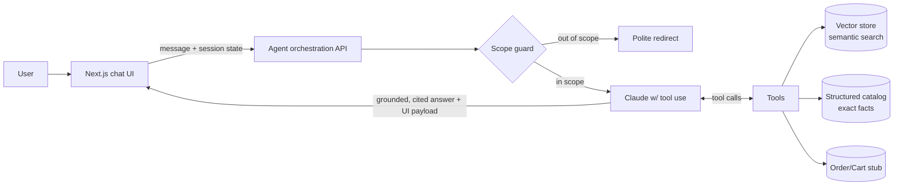

# PRD — PartSelect Chat Agent

| | |
|---|---|
| **Project** | Conversational AI agent for the PartSelect e-commerce site (Refrigerator & Dishwasher parts) |
| **Status** | Draft v0.1 |
| **Last updated** | 2026-06-05 |
| **Owner** | Devansh Karia |
| **Context** | Instalily case study submission |
| **Deliverables** | Source code · Loom walkthrough · (optional) slide deck |

---

## 1. Overview

Build a chat agent embedded in a PartSelect-branded web app that helps customers
**find parts, confirm compatibility, get installation & repair guidance, and
complete transactions** for **Refrigerator and Dishwasher** parts. The agent must
stay strictly within this domain, ground every factual claim in real catalog
data (no hallucinated prices or part numbers), and feel like a fast, trustworthy
extension of the PartSelect storefront.

This PRD covers product scope, user experience, agentic architecture, the data
foundation, and the extensibility/scalability story. Lower-level engineering
conventions — the agent's operating instructions (`CLAUDE.md`), custom skills,
hooks, and tool definitions — are intentionally **out of scope here** and will be
specified separately by the project owner (see §13).

## 2. Problem statement

PartSelect has an enormous catalog. Customers arrive with a *job to be done* — "my
ice maker stopped working," "will this fit my model?", "how do I install this?" —
but today must navigate search, model lookups, spec tables, and repair articles
themselves. A focused conversational agent collapses that journey into a single
natural-language interaction, increasing conversion and self-service resolution
while reducing support load.

## 3. Goals & success criteria

Aligned to the case-study evaluation axes:

1. **Interface design** — A polished, on-brand, responsive chat UI where products
   are first-class (rich cards, not wall-of-text), with streaming and clear CTAs.
2. **Agentic architecture** — A tool-using, retrieval-grounded agent with clean
   separation between reasoning, tools, and data; transparent and debuggable.
3. **Accuracy & efficiency** — Correct, grounded answers to the canonical queries
   (§6) and beyond, with low latency. Facts come from tools/data, never invented.
4. **Scope discipline** — Reliably refuses/redirects out-of-scope requests
   (other appliances, general chit-chat) while staying helpful.
5. **Extensibility & scalability** — Adding a new appliance category, tool, or
   data source is a small, well-defined change; the system scales to the full
   catalog and concurrent users.

### Non-goals (v1)
- Real payment processing or writing to PartSelect's real order systems
  (transactions are **simulated** against a stub service — see §9).
- Appliance categories beyond Refrigerator & Dishwasher (architecture supports
  them; they are simply not enabled in v1).
- User accounts/auth beyond a lightweight session.
- Native mobile apps (responsive web only).

## 4. Users & personas

- **DIY repair customer (primary)** — Has a broken appliance, may know the symptom
  but not the part; needs diagnosis → correct part → install confidence.
- **Part-number shopper** — Already has a PS#/model #; wants price, availability,
  compatibility confirmation, and checkout.
- **Existing-order customer** — Wants order status, returns, or post-purchase help.

## 5. Scope of the domain

**In scope:** Refrigerator & Dishwasher parts — product info, search/discovery,
compatibility (by appliance model #), installation guidance, symptom-based
troubleshooting, pricing/availability, and order/transaction support for those
parts.

**Out of scope (politely declined & redirected):** other appliance types,
non-PartSelect topics, general knowledge, anything unrelated to appliance-parts
commerce. Scope enforcement is a first-class requirement, not an afterthought (§8).

## 6. Canonical use cases (must-pass)

The three provided examples, mapped to capabilities:

| # | User query | Capability exercised | Expected agent behavior |
|---|---|---|---|
| 1 | "How can I install part number **PS11752778**?" | Part lookup + installation guide | Identify the part, return install steps, difficulty, time, required tools, and a how-to video link, plus a product card with price/availability. |
| 2 | "Is **this part** compatible with my **WDT780SAEM1** model?" | Context resolution + compatibility check | Resolve "this part" from conversation, check the part↔model mapping, answer yes/no with reasoning; if no, suggest the correct compatible part. |
| 3 | "The **ice maker** on my **Whirlpool fridge** is not working. How can I fix it?" | Symptom troubleshooting → parts | Return ranked likely causes, recommended replacement part(s) as cards, step-by-step repair guidance, and a safety note; offer to add parts to cart. |

These are the *floor*, not the ceiling — the design generalizes to the broader
use cases below.

### Broader user stories
- Discovery: "I need a door shelf bin for a Frigidaire fridge under $30."
- Comparison: "What's the difference between these two water filters?"
- Availability/price: "Is PS… in stock and how much?"
- Order support: "Where is my order #…?", "I want to return a part."
- Cart/checkout: "Add 2 of these," "check out."
- Maintenance: "How often should I replace my fridge water filter?"

## 7. Functional requirements

### 7.1 Chat experience (frontend)
- **Conversational UI** aligned to PartSelect branding (teal/dark-teal nav,
  yellow accents, OEM-trust framing; "Here to help since 1999" tone).
- **Streaming** responses with typing indicator.
- **Rich product cards** in-thread: image, name, PS# + MPN, brand, price,
  availability badge, rating/review count, and CTAs (View, Add to cart).
- **Compatibility result UI** (clear ✅/❌ with the model it was checked against).
- **Installation / troubleshooting blocks** — numbered steps, difficulty/time,
  collapsible detail, embedded how-to video links.
- **Suggested prompts / quick-reply chips** to guide users into scope.
- **Model-number capture** so compatibility checks are frictionless; remembered
  for the session.
- **Cart drawer / order-status panel** for transaction flows.
- **Source links** to the underlying PartSelect product pages (trust + verifiability).
- Accessibility (keyboard, ARIA, contrast) and mobile-responsive layout.
- Persisted conversation within a session; "clear chat."

### 7.2 Agent capabilities (backend)
The agent answers via **tool calls against grounded data** (see §8). Required
capability surface (final tool schemas defined later by the owner):

- **Product search** — semantic + structured filtering (appliance, brand, part
  type, price, availability) over the catalog.
- **Part detail lookup** — exact fields by PS# or MPN.
- **Compatibility check** — does part *X* fit model *Y*? (part↔model mapping).
- **Installation guide** — steps, difficulty, tools, video for a part.
- **Symptom troubleshooting** — symptom + appliance (+brand/model) → ranked causes
  → recommended parts → repair steps.
- **Order support** — order status, returns (simulated service).
- **Cart & checkout** — add/remove/view, simulated checkout.

## 8. Agentic architecture



**Design principles**
- **Grounding over generation.** Prices, part numbers, availability, and
  compatibility are always returned from tools/data; the model composes and
  explains but never fabricates a fact. Responses cite source product pages.
- **Tool-using agent, thin orchestration.** A transparent loop over Claude's
  native tool use — no heavyweight framework — so behavior is debuggable and
  each tool is independently testable.
- **Hybrid retrieval.** Vector search for fuzzy/natural-language discovery and
  symptom→part reasoning; structured (SQL) lookups for exact, authoritative
  fields and filters. The agent picks the right tool per intent.
- **Scope enforcement** as an explicit layer: a system-prompt contract plus a
  lightweight input check, so out-of-scope queries are declined consistently and
  cheaply (and never leak hallucinated answers).
- **Session memory.** Resolves references ("this part," "my model"), remembers the
  user's model number and cart across turns.
- **LLM:** Claude (Anthropic API) with tool use; exact model tier(s) finalized in
  implementation (latency-optimized model for chat, stronger model for complex
  troubleshooting reasoning).

## 9. Data foundation

The catalog is sourced by the **ingestion pipeline already built in `scraper/`**
(see `scraper/README.md`): a resilient `nodriver`-based crawler that gets past
PartSelect's Akamai Bot Manager and extracts the schema.org microdata on each
product page. A reference dataset of ~225 products (Refrigerator + Dishwasher)
is checked in; the pipeline scales to the full catalog.

**Per-product fields (available today):** `ps_number` (primary key), `mpn`,
`name`, `brand`, `price`, `currency`, `availability`, `rating`, `review_count`,
`description`, `image`, `appliance`, `part_type`, source `url`.

**Data to add (pipeline extends to these — see §10):**
- **Compatibility** — part↔model mapping from PartSelect `/Models/{MODEL}/` pages.
- **Installation/repair content** — install steps, difficulty, and how-to videos
  from product pages; symptom→cause→part mappings from repair-help pages.

**Serving layout:**
- **Structured store** (SQLite for dev → Postgres/`pgvector` for prod) — exact
  fields, filters, compatibility, cart/orders.
- **Vector store** — embeddings of product descriptions + repair/symptom content
  for semantic retrieval. Embeddings via a dedicated embeddings model.
- Transactions/orders backed by a **stub service** with seeded fixtures (no real
  PartSelect APIs exist publicly), structured so it can later swap to a real API.

## 10. Extensibility & scalability

**Extensibility (designed-in):**
- **New appliance category** = enable a new crawl seed + flip a scope flag; no
  architectural change.
- **New capability** = add one tool (schema + handler); the agent loop and UI
  card system are generic.
- **New data source** (model/compat, repair videos) = add an extractor to the
  pipeline; downstream serving is schema-driven.
- **Model/provider swap** = orchestration isolates the LLM behind one boundary.

**Scalability:**
- Ingestion proven against Akamai with backoff + browser recycling; documented
  path to residential-proxy + `curl_cffi` hybrid for full-catalog volume.
- Stateless orchestration API → horizontal scaling; session state externalized.
- Caching of hot lookups/embeddings; structured store indexed on PS#/MPN/model.

## 11. Evaluation & metrics

- **Correctness** — a regression suite built from the §6 canonical queries +
  broader stories; assert grounded, correct part #s/prices/compat verdicts.
- **Scope adherence** — a battery of out-of-scope prompts must be declined.
- **Groundedness** — no factual claim without a backing tool result/citation.
- **Latency** — time-to-first-token (streaming) and full-response targets.
- **UX** — task completion rate for the three canonical journeys.

## 12. Milestones (proposed)

1. **Foundation** — repo structure (done), catalog ingestion (done), data serving
   (structured + vector).
2. **Agent core** — orchestration loop, core tools (search, part lookup,
   compatibility), scope guard, grounding.
3. **Experience** — branded Next.js chat UI, product cards, streaming, cart.
4. **Depth** — installation guides + symptom troubleshooting (data + tools).
5. **Polish & eval** — order support, evaluation suite, latency tuning.
6. **Submission** — Loom walkthrough + (optional) slide deck.

## 13. Development methodology (owner-directed)

Per the project owner, the agent's engineering conventions will be encoded as a
set of artifacts to be supplied separately and used during build:
- **`CLAUDE.md`** — operating instructions/conventions for the build.
- **Skills, hooks, and tools** — reusable capabilities, automated checks, and the
  concrete tool implementations.

This PRD defines *what* and *why*; those artifacts will govern *how* we build.

## 14. Risks & mitigations

| Risk | Mitigation |
|---|---|
| Hallucinated prices/part #s erode trust | Strict grounding; facts only from tools; cite sources |
| Scope creep into other appliances/topics | Explicit scope-guard layer + system contract + tests |
| Data gaps (compat, repair) for v1 | Pipeline extends to model/repair pages; graceful "I don't have that yet" fallback |
| Akamai breaks ingestion at scale | Backoff/recycle in place; documented proxy/hybrid escalation |
| Latency on complex troubleshooting | Tiered models; cache; stream partial results |

## 15. Assumptions & open questions

- **Assumption:** LLM is Claude (Anthropic API). *Confirm final model tiers.*
- **Assumption:** Transactions/orders are simulated for v1.
- **Open:** Backend shape — Next.js API routes vs. a separate Python service for
  ingestion/serving. (Owner to finalize via §13 artifacts.)
- **Open:** Vector store choice (pgvector vs. hosted) and embeddings model.
- **Open:** Depth of repair/troubleshooting content to scrape for v1.

## Appendix A — repository layout

```
partselect-scrap/
├── PRD.md                  ← this document
├── .gitignore
└── scraper/                ← data ingestion pipeline (built & verified)
    ├── scrape.py           ← Akamai-resilient nodriver crawler
    ├── parser.py           ← schema.org microdata extractor
    ├── requirements.txt
    ├── README.md
    ├── data/partselect.db  ← reference catalog (~225 products)
    └── samples/            ← captured pages used as parser fixtures
# Forthcoming: frontend/ (Next.js chat UI), backend/ (agent + tools + serving)
```
