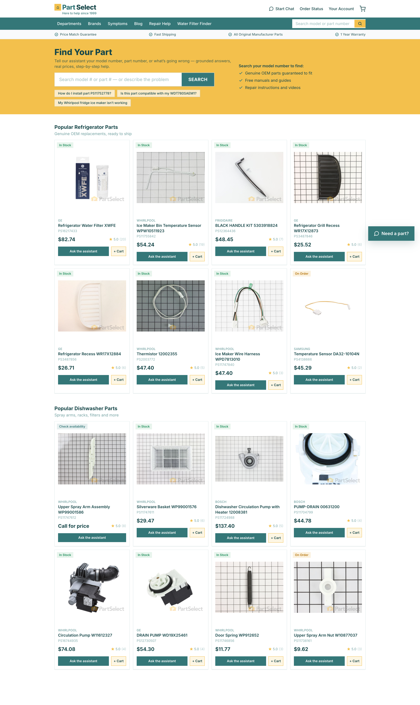
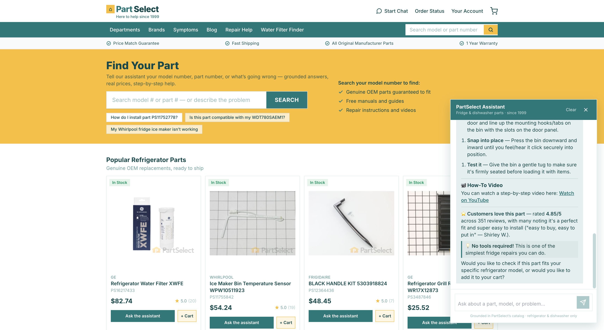
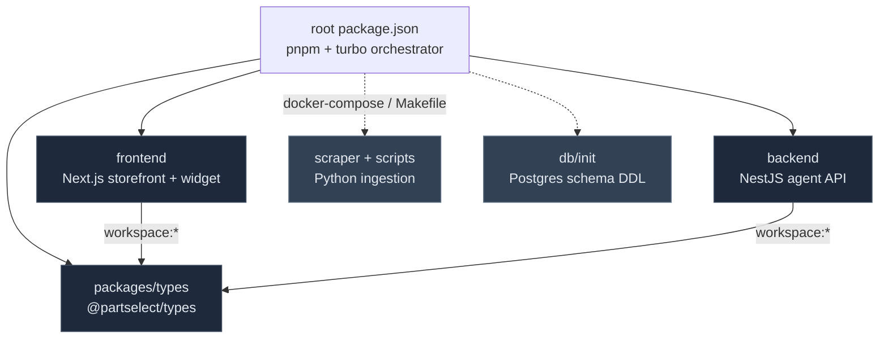
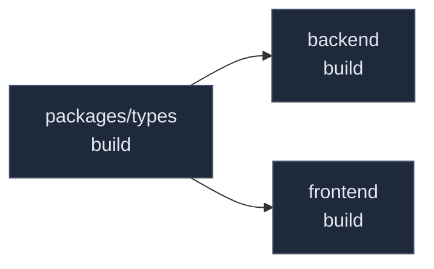
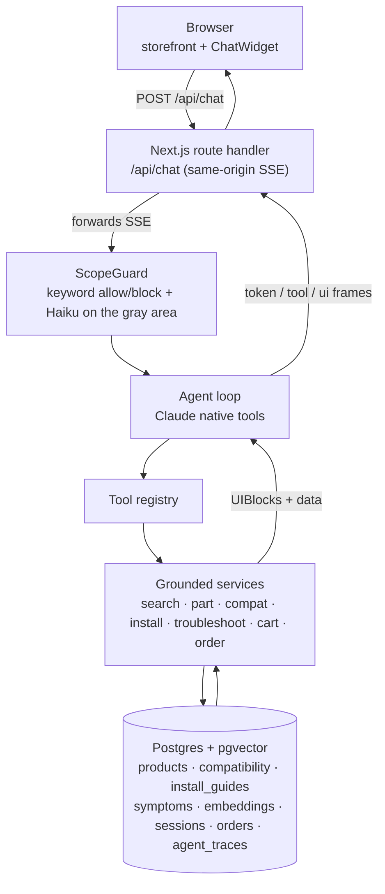

# PartSelect Chat Agent

A production-style conversational agent for the PartSelect storefront, scoped to
**Refrigerator and Dishwasher parts**. It finds parts, confirms whether a part fits a
model, gives installation help with real how-to videos, troubleshoots symptoms, and runs
a simulated cart and checkout. It answers only from grounded catalog data, so it will not
invent a price or a part number.

Built with **Next.js** for the storefront and floating chat widget, **NestJS** for a thin
and transparent tool-use loop over Claude, **Postgres with pgvector** for hybrid SQL and
semantic retrieval, and a **Python** ingestion pipeline. The whole thing is containerized
with Docker.




---

## Workspace wiki

This repo is a monorepo. Each app and package has its own guide. Start with whichever part
you are working on.

| Guide | What it covers |
|-------|----------------|
| [backend/README.md](./backend/README.md) | The NestJS agent API: the tool-use loop, the tool pattern, scope, model tiering, memory, and traces. |
| [frontend/README.md](./frontend/README.md) | The Next.js storefront and chat widget: SSE streaming, the Zustand store, and the typed-block renderer. |
| [packages/README.md](./packages/README.md) | `@partselect/types`, the shared contract that keeps the two apps in sync. |

The rest of this file is the bird's-eye view: how the monorepo is wired, how a request
travels end to end, and how the data gets in.

---

## The monorepo at a glance

The repository is a **pnpm workspace** driven by **Turborepo**. The root is not an app. It
is an orchestrator that pins the toolchain, holds the top-level scripts, and owns the
Docker and database layers. The actual code lives in three workspace members plus a Python
pipeline that sits alongside them.



A few things worth knowing about this layout:

- **The root holds no source.** Its `package.json` is `private`, pins `pnpm@10.15.1` and
  Node 20, and its scripts just call `turbo run`. Running `pnpm dev` at the root fans the
  command out to every member that defines a `dev` task.
- **The shared types package is the reason a monorepo earns its keep here.** The frontend
  and backend both depend on `@partselect/types` through `workspace:*`, so a change to a
  payload shape is a compile error on both sides at once. pnpm symlinks that package in
  from the root, which is why dependencies hoist to the root `node_modules`.
- **The Python pipeline lives in the same repo but outside the JS workspace.** pnpm and
  Turborepo do not manage it. It is orchestrated through the `Makefile` and
  `docker-compose.yml` instead. That split is deliberate: the scraper and seed run offline
  before boot, so they never need to share the JS toolchain.

### How Turbo schedules the build

`turbo.json` declares the task graph. The line that matters is `dependsOn: ["^build"]` on
the `build` task, which means "build everything I depend on first". So the shared types
compile before the apps that import them, with no manual ordering.



The top-level scripts all follow this pattern:

```jsonc
"dev":   "turbo run dev",     // runs every member's dev task in parallel
"build": "turbo run build",   // ordered by ^build, with output caching
"test":  "turbo run test",
"eval":  "turbo run eval --filter=backend"
```

---

## Quick start

```bash
cp .env.example .env          # add ANTHROPIC_API_KEY (required) and VOYAGE_API_KEY (semantic search)
make up                       # builds + runs db → seed → backend → frontend
```

- **Storefront and chat:** http://localhost:3000
- **Agent API:** http://localhost:3001/health

`make up` is one command from a clean clone. Boot is offline and deterministic. Postgres
initializes its schema from `db/init/*.sql`, then a one-shot `seed` loads the committed
catalog snapshot (`scraper/data/partselect.db`), including scraped enrichment and
pre-computed embeddings. Nothing on the boot path needs a paid API at startup. Only the
live agent does.

```bash
make eval     # run the evaluation suite (canonical + scope + groundedness) against the agent
make psql     # poke the database
make down     # stop the stack
make reset    # drop the volume + rebuild + reseed (after a schema or snapshot change)
```

---

## The three canonical journeys

All three pass live and in the eval suite.

| # | Ask | What happens |
|---|-----|--------------|
| **1** | *"How can I install part number PS11752778?"* | `get_part_details` and `get_install_guide` return a product card plus an install guide with difficulty, tools, the real embedded how-to video, and numbered steps composed from the scraped customer repair narratives. |
| **2** | *"Is this part compatible with my WDT780SAEM1 model?"* | Resolves "this part" from the conversation and the model number from memory, then `check_compatibility` does a deterministic table lookup and returns a grounded COMPATIBLE, INCOMPATIBLE, or UNKNOWN verdict, with a "try this instead" suggestion when it does not fit. |
| **3** | *"The ice maker on my Whirlpool fridge is not working. How can I fix it?"* | Routes to the Opus tier, `troubleshoot_symptom` retrieves the closest symptom with pgvector, and the answer comes back as ranked causes, real recommended parts as cards, repair steps, and a safety note. |

On top of those: discovery search, price and availability, comparisons, add-to-cart,
simulated checkout, and order status. A hard scope guard politely declines other
appliances and off-topic questions.

---

## How a request travels end to end

The browser only ever talks to its own origin. The Next.js route handler proxies the call
to NestJS server-side, so the backend URL and any future auth stay off the client.



**Grounding is structural.** The agent never renders a price, a PS number, or a
compatibility verdict as prose. Each one is returned as a typed `UIBlock`
([`packages/types`](./packages/README.md)), built server-side from a real database row,
and rendered by the frontend. The model composes the explanation, the data comes from the
blocks. An eval invariant asserts that every PS number the assistant utters also appears
in a rendered block.

**Model tiering** is chosen by the owner, not the model. Sonnet 4.6 runs the loop, Haiku
4.5 handles the rare ambiguous scope check, and Opus 4.8 escalates on troubleshoot turns.
Prompt caching is applied to the stable tools and system prefix, confirmed by reading
`cache_read` in the traces.

**Conversational context** has two layers. Each turn replays a sliding window of recent
messages (`SESSION_WINDOW_MESSAGES`, default 20, trimmed to begin on a user turn). Durable
entities such as the captured model number, the "this part" referent, and the cart live in
dedicated session columns, so they survive after older turns slide out of the window.

**Observability.** Every turn writes an `agent_traces` row with the tools, args, per-step
latency, tokens, cache reads, model tier, scope verdict, and timings. `GET
/debug/trace/:turnId` returns it.

**API docs.** The REST surface is documented with OpenAPI via `@nestjs/swagger`. With the
backend running, Swagger UI is at `http://localhost:3001/docs` (raw spec at `/docs-json`).
The shared `@partselect/types` package stays the compile-time contract for the in-repo
frontend and the SSE stream; OpenAPI documents the HTTP boundary for any other consumer.
See the [backend guide](./backend/README.md) for the reasoning.

The [backend guide](./backend/README.md) goes deeper on the loop, the tool pattern, and
the scope router. The [frontend guide](./frontend/README.md) covers the SSE streaming and
the block renderer.

---

## Data pipeline: offline data-prep, deterministic boot

The catalog of 225 refrigerator and dishwasher parts was scraped into SQLite. Enrichment
and embeddings are offline data-prep that refresh that committed snapshot. The Postgres
seed is a deterministic, offline load from it.

```
scraper/scrape.py --enrich     re-visits product pages: compatible-model lists, how-to videos,
                               customer repair stories, "fixes these symptoms" inverted index
scraper/scrape.py --models M…  scrapes /Models/{M}/ and records which catalog parts fit a model
scripts/embed.py               Voyage voyage-3.5 (1024-dim) vectors back into the snapshot
scripts/seed_postgres.py       deterministic load into Postgres (part_type cleanup, Ice Maker and
                               Freezer remapped to Refrigerator, in_scope flags, FK-validated
                               recommendations)
```

`make scrape` and `make embed` regenerate the snapshot. `make up` never depends on them.

**Hybrid retrieval:** exact SQL for PS#, MPN, and model lookups, deterministic joins for
compatibility, and pgvector cosine for fuzzy discovery and symptom matching. A `pg_trgm`
fallback keeps search working even if embeddings are not loaded.

---

## Extensibility

These are the seams designed into the system.

- **New capability:** implement the `AgentTool` interface in one file and add it to the
  `TOOLS` array in `backend/src/tools/tools.module.ts`. The loop, schemas, traces, and UI
  renderer are all generic. See the [backend guide](./backend/README.md).
- **New appliance category:** add it to `ENABLED_APPLIANCES` in
  [`packages/types`](./packages/README.md) and add a crawl seed. No architecture change.
- **New data source:** one extractor in `scraper/extractors.py`, one table, one
  repository.
- **Swap the LLM provider or model:** `backend/src/llm/llm.service.ts` is the only Claude
  boundary.
- **Swap the embeddings provider:** `EmbeddingsService` is one interface, Voyage today.
- **Externalize sessions to Redis:** the `SessionService` is the port, Postgres-backed
  today.

---

## Evaluation

`make eval` boots the agent and runs Jest against the real LLM and database:

- **`canonical.e2e-spec.ts`** checks that UC1, UC2, and UC3 produce the right tools and
  grounded blocks.
- **`scope.e2e-spec.ts`** checks that out-of-scope prompts are declined and that valid
  fridge or dishwasher phrasings are never wrongly declined.
- **`groundedness.e2e-spec.ts`** checks that every PS number in an answer appears in a
  rendered block.

All 13 checks pass. Time to first token is typically around 1 second, under the 1.5 second
target.

---

## Project structure

```
backend/    NestJS agent API: agent loop, tools, retrieval, scope guard, SSE, traces, eval
            → see backend/README.md
frontend/   Next.js storefront + floating chat widget, typed-block renderer, cart drawer
            → see frontend/README.md
packages/   @partselect/types, the UI-payload contract shared by both apps
            → see packages/README.md
scraper/    Python crawler + extractors (Akamai-resilient nodriver + selectolax)
scripts/    seed_postgres.py (deterministic load) and embed.py (Voyage embeddings)
db/init/    Postgres schema DDL (extensions + tables), the single owner of the schema
docker/     seed image and the docker-compose stack (db · seed · backend · frontend)
```

**Stack:** Next.js 16, NestJS 11 with `@nestjs/swagger` (OpenAPI), Postgres 16 with
pgvector, `@anthropic-ai/sdk` (Claude Opus 4.8, Sonnet 4.6, Haiku 4.5), Voyage
`voyage-3.5`, pnpm with Turborepo, and Docker.

A note on the data layer: the backend uses `pg` (node-postgres) directly rather than an
ORM. The hybrid vector and trigram retrieval is raw SQL by nature, the rest is simple
CRUD, and this keeps the data path readable and the container build free of an ORM engine
binary. `db/init/*.sql` owns the schema, the seed only inserts.

See [`PRD.md`](./PRD.md) for the product spec and design rationale.
