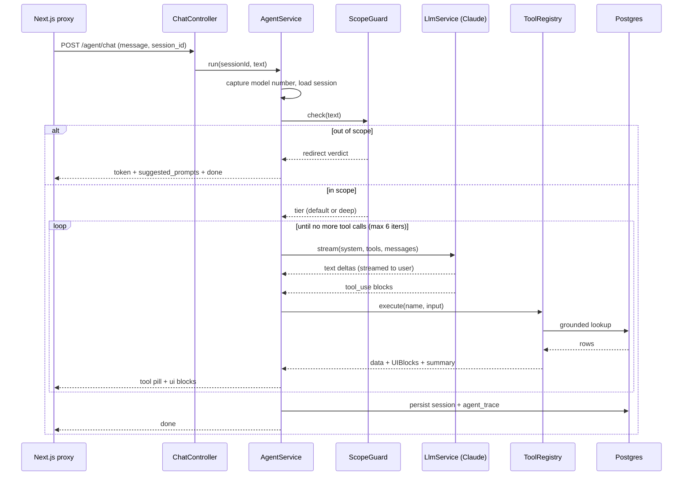
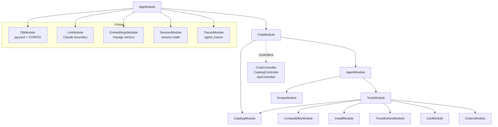

# backend: NestJS agent API

This is the brain of the project. It takes a user message, decides whether it is in
scope, runs a tool-use loop over Claude, and streams the answer back as Server-Sent
Events. Every price, part number, and compatibility verdict it sends to the browser
comes from a real database row, never from the model's imagination.

Part of the [PartSelect monorepo](../README.md). It shares its types with the
[frontend](../frontend/README.md) through [`@partselect/types`](../packages/README.md).

```
Stack: NestJS 11 · @nestjs/swagger (OpenAPI) · @anthropic-ai/sdk (Claude) · pg (node-postgres) · Postgres 16 + pgvector · Jest
Runs on: http://localhost:3001
```

---

## What it does in one turn

When a chat message arrives, the agent walks a fixed path. The interesting part is that
the loop itself is generic: it does not know what "compatibility" or "troubleshooting"
mean. It only knows how to call tools and stream their output.



The loop lives in `src/agent/agent.service.ts`. Read that file first if you want to
understand the system. Everything else is a service it calls.

---

## How the modules fit together

NestJS wires the app through modules. Five of them are global, so any service can inject
them without an explicit import. The rest hang off `ChatModule`, which is the only
feature module `AppModule` pulls in directly.



A practical way to read this: `ChatController` is the front door, `AgentService` is the
orchestrator, `ToolRegistry` is the dispatcher, and the feature modules (catalog,
compatibility, install, troubleshoot, cart, orders) are the grounded workers that talk
to Postgres.

---

## The tool pattern

A capability is one class that implements the `AgentTool` interface
(`src/tools/tool.types.ts`). Each tool owns four things: a name, a description that
Claude reads to decide when to call it, a JSON input schema, and a `run` method that
returns three pieces of output.

```ts
interface AgentTool {
  name: string;
  description: string;            // Claude reads this to pick the tool
  inputSchema: Record<string, unknown>;
  label(input): string;          // "Searching catalog…" pill shown while it runs
  run(input, ctx): Promise<ToolResult>;
}

interface ToolResult {
  data: unknown;     // JSON the model reasons over on the next loop iteration
  ui: UIBlock[];     // typed blocks streamed to the browser and rendered as cards
  summary: string;   // one line for the trace
}
```

The split between `data` and `ui` is the whole grounding story. `data` goes back into the
conversation so the model can explain what it found. `ui` carries the actual numbers and
gets rendered by the frontend. The model writes the prose around the card, it does not
write the card.

The nine tools registered today, in `src/tools/tools.module.ts`:

| Tool | Service it calls | Returns |
|------|------------------|---------|
| `get_part_details` | CatalogService | one part by PS# or MPN |
| `search_parts` | CatalogService | semantic + filtered catalog search |
| `check_compatibility` | CompatibilityService | fits / does not fit a model number |
| `get_install_guide` | InstallService | how-to video, difficulty, repair narratives |
| `troubleshoot_symptom` | TroubleshootService | ranked causes + the parts that fix them |
| `add_to_cart` | CartService | updated cart block |
| `view_cart` | CartService | current cart block |
| `checkout` | OrdersService | simulated order confirmation |
| `get_order_status` | OrdersService | order status block |

To add a tool: write the class, add it to the `TOOLS` array, done. The registry builds
the schema list, the loop calls it, the trace records it, and the frontend already knows
how to render any `UIBlock` it emits.

---

## Scope, tiers, and memory

**ScopeGuard** (`src/scope/scope.service.ts`) runs before the model. It is a keyword
allow and block list plus a regex for PS numbers, with the language model only consulted
on the ambiguous middle cases. Refrigerator and dishwasher talk passes. Washing machines,
recipes, and stock prices get politely declined with a redirect. Symptom language
("not draining", "won't turn on") flips the turn onto the deep tier.

**Model tiering** is set by the owner, not the model, and centralized in
`src/llm/llm.service.ts`:

```
fast    → Haiku 4.5    ambiguous scope checks only
default → Sonnet 4.6   runs the tool-use loop
deep    → Opus 4.8     troubleshoot turns, with adaptive thinking at high effort
```

Swapping a provider or a model touches this one file. Prompt caching is applied to the
stable tools and system prefix, and you can confirm it landed by reading `cache_read` in
the trace.

**Memory** has two layers. Recent chat replays as a sliding window
(`SESSION_WINDOW_MESSAGES`, default 20, trimmed to start on a user turn). Durable facts
live in their own session columns: the captured appliance model number, the "this part"
referent, and the cart. That is why "is this part compatible with my model" still works
ten turns later, after the original messages have slid out of the window.

---

## Observability

Every turn writes one `agent_traces` row: the tools it called, their arguments, per-step
latency, input and output tokens, cache reads, the model tier, the scope verdict, time to
first token, and total time. Pull one back with:

```bash
curl localhost:3001/debug/trace/<turnId>
```

This is how you answer "why did it do that" without adding print statements.

---

## API documentation (OpenAPI / Swagger)

The REST surface is documented with `@nestjs/swagger`. Boot the backend and open:

```
Swagger UI:  http://localhost:3001/docs
Raw spec:    http://localhost:3001/docs-json
```

Ten operations across four tags: `chat` (the SSE turn), `catalog` (products, facets),
`cart` (view, add, set-qty, checkout), and `system` (health, session, trace).

**Why both Swagger and shared types?** They cover different boundaries, on purpose.

- `@partselect/types` is the contract between the NestJS API and the Next.js app. Because
  both are TypeScript in one workspace, a shared package gives a *compile-time* guarantee:
  change a field and both sides stop building. That is stronger than codegen'd OpenAPI
  clients, which can silently drift.
- OpenAPI documents the *HTTP* boundary (routes, status codes, request and response
  shapes) for any consumer that is not the in-repo frontend: a future mobile client, a
  partner, or a non-TypeScript service.

The DTOs live in `src/http/dto.ts`. They are never instantiated; they exist only to carry
the `@ApiProperty` metadata Swagger reads (TypeScript interfaces are erased at runtime, so
the shared types can't carry it themselves). Each DTO `implements` its `@partselect/types`
interface, so the documented schema cannot drift from the real contract without failing
the build. The streaming `POST /agent/chat` endpoint is the one place OpenAPI is weak (it
can't model an SSE stream), so it is documented as a `text/event-stream` response whose
body is the `oneOf` of the six `ChatEvent` frame shapes.

---

## Directory map

```
src/
  main.ts                 boot, CORS for dev curling, shutdown hooks
  app.module.ts           wires the five global modules + ChatModule
  config.ts               env config; tiers, embed dims, window size, max iters

  agent/
    agent.service.ts      the tool-use loop (start here)
    system-prompt.ts      the contract handed to Claude + suggested chips
  scope/                  ScopeGuard: in / out / troubleshoot routing
  llm/                    LlmService: the single Claude boundary, tier → model
  tools/
    tool.types.ts         AgentTool + ToolResult interfaces
    tool.registry.ts      name → tool dispatch, schema list, error wrapping
    tools.module.ts       the TOOLS roster (add a capability here)
    impl/                 one file per capability
  catalog/                part lookup, search, storefront grid, facets
                          + CatalogController (GET /catalog/*)
  http/dto.ts             OpenAPI/Swagger DTOs mirroring @partselect/types
  compatibility/          deterministic part ↔ model table lookup
  install/                how-to video + repair narratives
  troubleshoot/           symptom retrieval via pgvector
  cart/  orders/          simulated cart + checkout + order status
  session/                session load, persist, sliding window
  db/                     pg pool, raw SQL (no ORM by design)
  embeddings/             Voyage voyage-3.5 vectors
  traces/                 agent_traces writer + reader
  chat/                   ChatController (SSE) + ApiController (health, session, trace)

test/eval/                canonical · scope · groundedness specs (make eval)
```

A note on the data layer: this service talks to Postgres through `pg` directly rather
than an ORM. The hybrid vector and trigram retrieval is raw SQL by nature, the rest is
plain CRUD, and skipping the ORM keeps the container build free of a native engine
binary. The schema is owned by `db/init/*.sql` at the repo root; this service only reads
and inserts.

---

## Running and testing

These commands run through the monorepo, so prefer the root `Makefile` for the full
stack. To work on the backend alone:

```bash
pnpm --filter backend start:dev   # watch mode on :3001
pnpm --filter backend test        # unit tests
pnpm --filter backend eval        # the live eval suite (needs a real API key + seeded db)
```

The eval suite boots the agent and checks three things against the real model and
database: the three canonical journeys call the right tools and emit grounded blocks,
out-of-scope prompts get declined while valid ones do not, and every PS number the
assistant says out loud also appears in a rendered block. That last check is the
groundedness invariant, and it is the one worth keeping green.
