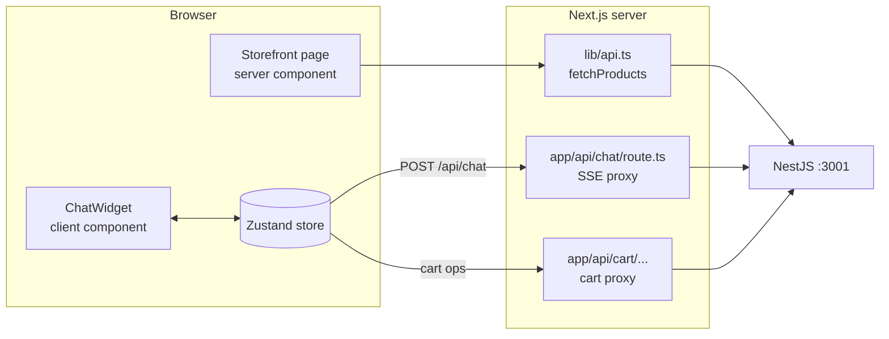
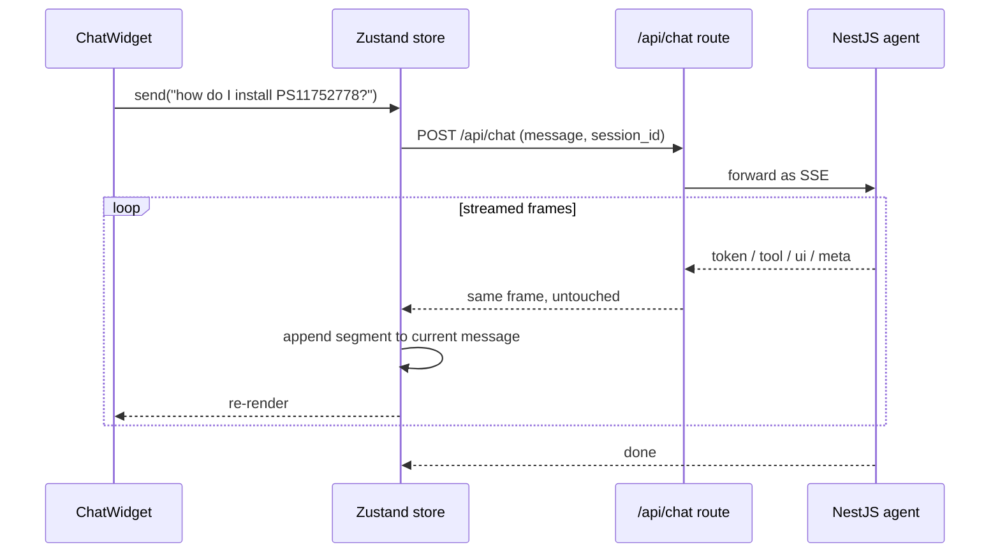

# frontend: Next.js storefront + chat widget

This is what the user sees: a mock PartSelect storefront with a floating chat widget in
the corner. The storefront is rendered on the server from real catalog data. The widget
holds a live conversation with the agent and renders its answers as cards, not as a wall
of text.

Part of the [PartSelect monorepo](../README.md). It speaks to the
[backend](../backend/README.md) over a same-origin proxy and shares every payload shape
through [`@partselect/types`](../packages/README.md).

```
Stack: Next.js 15 (App Router) · React 19 · Zustand · Tailwind
Runs on: http://localhost:3000
```

---

## Two jobs, one app

The frontend does two unrelated things, and it helps to keep them separate in your head.

1. **The storefront.** Server components fetch parts from the backend catalog API at
   request time and render product grids. This is plain server-side rendering. No agent
   involved.
2. **The chat widget.** A client component that streams a conversation with the agent and
   renders typed blocks inline as they arrive.



The backend URL lives only on the server (`INTERNAL_API_URL`). The browser always talks
to its own origin, and the Next.js route handlers forward the call. That keeps the
backend address and any future auth off the client.

---

## How a chat turn flows

The widget never touches the backend directly. It posts to `/api/chat` on its own origin,
and the route handler at `app/api/chat/route.ts` pipes the Server-Sent Events stream
straight through to NestJS. The store reads that stream frame by frame and updates the UI
as each one lands.



The frames are typed in `@partselect/types` as `ChatEvent`: `token` for streamed prose,
`tool` for the status pill ("Searching catalog…"), `ui` for the blocks to render, `meta`
for session and model-number updates, and `done` to close the turn.

---

## Why messages are lists of segments

The detail that makes the chat feel right is in `lib/store.ts`. An assistant message is
not a single string. It is an ordered list of segments:

```ts
type Segment =
  | { type: 'text'; text: string }
  | { type: 'tool'; name: string; label: string; status: 'running' | 'done' | 'error' }
  | { type: 'block'; block: UIBlock };
```

Because segments are kept in arrival order, a product card shows up exactly where the
tool ran inside the answer, instead of every card piling up at the bottom. The store
appends to this list as each SSE frame comes in, so the rendered message grows in the
same shape the agent produced it.

The store also owns the cart, the captured model number, the session id, and whether the
widget and cart drawer are open. It persists a trimmed slice to `localStorage` so a
refresh keeps the last conversation and cart.

---

## The typed-block renderer

Everything grounded that the agent shows is a `UIBlock`. `BlockRenderer.tsx` is a switch
over the block `kind` that maps each one to a component:

| Block kind | Rendered as |
|------------|-------------|
| `product_card` | a part card with price, availability, image, add-to-cart |
| `compat_result` | a fits / does not fit verdict with a suggested swap |
| `install_guide` | difficulty, tools, the embedded how-to video, numbered steps |
| `troubleshoot` | ranked causes, recommended parts, repair steps, safety note |
| `cart` | the cart contents and subtotal |
| `order_status` | a simulated order summary |
| `suggested_prompts` | clickable chips that prefill the next question |
| `unavailable` | an honest "I do not have verified X yet" fallback |

The renderer is generic. When the backend adds a new block kind to the shared union, you
add one case here and nothing else in the data path changes.

---

## Direct cart operations

Not every cart action goes through the agent. Clicking "add to cart" on a storefront card
calls the store's `addToCart` directly, which posts to `/api/cart/[action]` and back to
NestJS. This skips the model for the obvious button clicks while the conversational
"add this part to my cart" still routes through the agent's `add_to_cart` tool. Both end
up mutating the same seeded cart on the backend.

---

## Directory map

```
app/
  layout.tsx              root layout, fonts, global shell
  page.tsx                storefront home (server component, fetches catalog)
  globals.css             Tailwind layer + base styles
  api/
    chat/route.ts         SSE proxy: browser → here → NestJS
    cart/[action]/route.ts  cart proxy (add, set qty, checkout)
    session/clear/route.ts   reset the conversation

components/
  storefront/             HeroAsk, ProductGrid, StorefrontCard
  widget/ChatWidget.tsx   the floating chat surface
  blocks/BlockRenderer.tsx  UIBlock → component switch
  cart/CartDrawer.tsx     slide-out cart
  shell/                  TopNav, TrustBar

lib/
  api.ts                  server-side catalog fetch + INTERNAL_API_URL
  store.ts                Zustand store: messages, segments, cart, SSE handling
  format.ts               price / availability formatting helpers
```

---

## Running on its own

The full stack comes up with `make up` from the repo root. To iterate on the UI alone:

```bash
pnpm --filter frontend dev    # http://localhost:3000
```

The storefront expects the backend catalog API at `INTERNAL_API_URL` (default
`http://localhost:3001`). With no backend running, the page renders but shows an empty
catalog notice instead of product grids, so you can still work on layout without the full
stack up.
