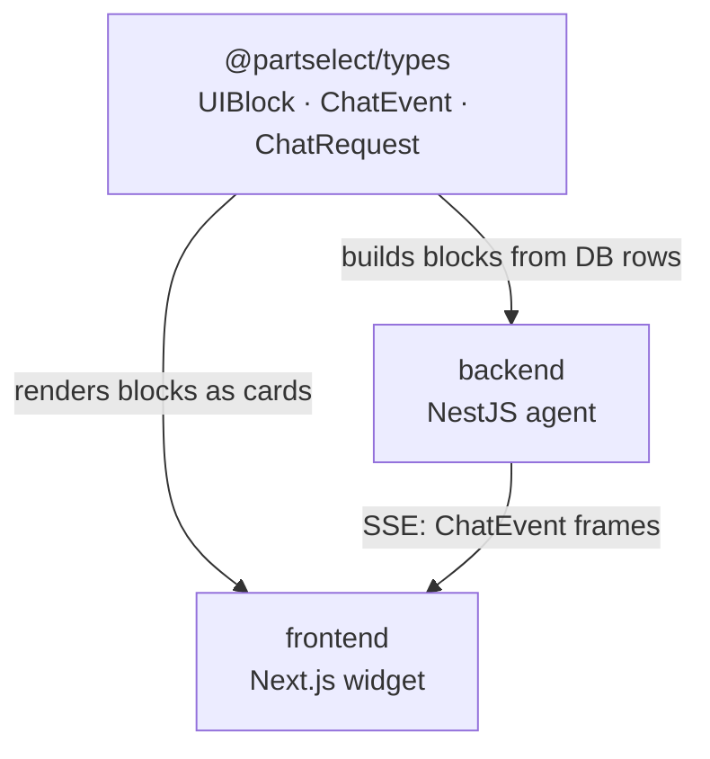

# packages: shared workspace libraries

This folder holds the internal packages that more than one app depends on. Right now
there is exactly one, and it is small on purpose: `@partselect/types`, the contract that
keeps the [backend](../backend/README.md) and the [frontend](../frontend/README.md)
honest with each other.

Part of the [PartSelect monorepo](../README.md).

```
packages/
  types/    @partselect/types, the UI-payload contract shared by both apps
```

---

## Why this package exists

The agent has a rule: it never writes a price, a part number, or a compatibility verdict
as prose. Instead it emits a typed block built server-side from a real database row, and
the frontend renders it. For that to work, both sides have to agree on the exact shape of
every block, down to the field names.

`@partselect/types` is that agreement, written once as TypeScript. The backend imports it
to build blocks. The frontend imports it to render them. Because it is one source, a
change to a block shape is a compile error on both sides at the same time, which is the
behavior you want.



The dependency only points inward. Both apps depend on the types package. The types
package depends on nothing. That is what lets it stay a pure compile-time contract with no
runtime weight.

---

## What is in the contract

The package is a single file, `src/index.ts`, grouped into three parts.

**1. The vocabulary.** Small unions that the rest of the types build on, plus the locked
scope of the product.

```ts
type Availability  = 'InStock' | 'OnOrder' | 'SpecialOrder' | 'Unknown';
type CompatVerdict = 'COMPATIBLE' | 'INCOMPATIBLE' | 'UNKNOWN';
type Appliance     = 'Refrigerator' | 'Dishwasher';

const ENABLED_APPLIANCES: Appliance[] = ['Refrigerator', 'Dishwasher'];
```

`ENABLED_APPLIANCES` is the seam for adding a category. Add an appliance here, add a crawl
seed, and the rest of the system follows. No architecture change.

**2. The UI blocks.** Each block is a discriminated union member tagged by `kind`. This is
the payload the agent sends and the frontend renders.

```ts
type UIBlock =
  | ProductCard         // kind: 'product_card'
  | CompatResult        // kind: 'compat_result'
  | InstallGuide        // kind: 'install_guide'
  | TroubleshootBlock   // kind: 'troubleshoot'
  | CartBlock           // kind: 'cart'
  | OrderStatusBlock    // kind: 'order_status'
  | SuggestedPrompts    // kind: 'suggested_prompts'
  | UnavailableBlock;   // kind: 'unavailable'
```

The `kind` tag is what makes the frontend renderer a clean switch and what makes the
backend tools type-safe when they construct a block. `UnavailableBlock` is worth calling
out: it is the honest fallback the agent reaches for when it has no verified data, which
keeps it from inventing an answer.

**3. The streaming frames.** The wire format between NestJS and the browser is a sequence
of `ChatEvent`s, sent as Server-Sent Events and passed through the Next.js proxy
untouched.

```ts
type ChatEvent =
  | TokenEvent    // a streamed chunk of assistant prose
  | ToolEvent     // a status pill: "Searching catalog…" running / done / error
  | UIEvent       // { blocks: UIBlock[] } to render in the thread
  | MetaEvent     // session id, captured model number, turn id
  | DoneEvent     // end of turn
  | ErrorEvent;   // something went wrong

interface ChatRequest { message: string; session_id?: string }
```

The frontend store reads these in order and builds the message out of them. The backend
agent loop yields them as it goes. Same types, both ends.

---

## How it builds

It is a plain TypeScript library that compiles to `dist/`. pnpm links it into both apps
through the `workspace:*` dependency, so an import of `@partselect/types` resolves to this
local package, not to a published one.

```jsonc
// the package
"main":  "dist/index.js",
"types": "dist/index.d.ts",
"scripts": { "build": "tsc", "dev": "tsc --watch" }

// how the apps depend on it
"@partselect/types": "workspace:*"
```

Under Turborepo this package's `build` runs before the apps that consume it, because their
build task declares `dependsOn: ["^build"]`. So a type change is compiled into `dist/`
before the frontend or backend tries to use it.

```bash
pnpm --filter @partselect/types build   # one-off compile
pnpm --filter @partselect/types dev      # watch mode while editing both apps
```

---

## Adding a new shared package

When a second package earns its place, drop it under `packages/` and the workspace picks
it up automatically. `pnpm-workspace.yaml` at the root already globs `packages/*`, so the
only steps are creating the folder with its own `package.json` and adding it to whichever
app needs it with `"<name>": "workspace:*"`.
